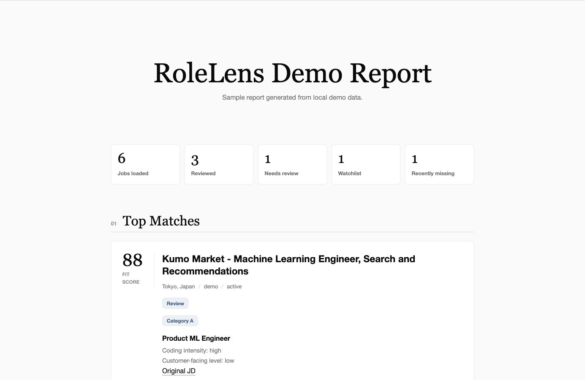

# RoleLens

RoleLens is a local-first, agent-assisted job radar for technical roles. It
collects official job openings, prepares them for coding-agent review, and
generates static HTML/Markdown reports showing which roles are aligned with a
candidate's goals.

RoleLens V1 is not a web app or an autonomous crawler. The CLI handles
deterministic local steps, while a coding agent can help set up candidate
context, review queued job descriptions, and write structured review results.



## Demo Flow

Run the demo workflow:

```bash
rolelens demo
```

This reads the committed sample data in `data/sample_jobs.json` and
`data/sample_reviews.json`, then writes:

```text
reports/demo.html
reports/demo.md
```

The demo does not require real CV data, API keys, internet access, successful
scrapers, or a coding agent.

## Install

RoleLens requires Python 3.11 or newer.

Using `venv` and `pip`:

```bash
python3 -m venv .venv
source .venv/bin/activate
python -m pip install --upgrade pip
python -m pip install -e ".[dev]"
```

If you use `uv`:

```bash
uv venv
source .venv/bin/activate
uv pip install -e ".[dev]"
```

Verify the install:

```bash
rolelens demo
pytest
```

## Coding Agent Flow

RoleLens is designed to be used with a coding agent. The CLI handles local,
repeatable steps; the agent helps prepare candidate context and review queued
job descriptions.

1. Ask the agent to follow `prompts/setup_candidate_profile.md`.
2. Create `candidate/profile.yaml` from `candidate/profile.example.yaml`.
3. Add private CV context as `candidate/cv.md` when useful.
4. Ask the agent to follow `prompts/update_and_review.md`.
5. Run:

```bash
rolelens setup-check
rolelens update
rolelens triage
```

6. Read `reports/review_plan.md` first and choose a small `likely` set for
   full agent review.
7. The agent reviews selected queued jobs in `review_queue/*.prompt.md` using
   `prompts/reviewer.md`.
8. The agent writes one structured result per job under `review_results/`.
9. Import reviews and regenerate the report:

```bash
rolelens import-reviews review_results/
rolelens report
```

Read the latest personal report at:

```text
reports/latest.html
reports/latest.md
```

Agent boundaries:

- Read private context from `candidate/profile.yaml` and `candidate/cv.md`.
- Treat `review_queue/*.job.json` as the source of truth for job descriptions.
- Write review outputs to `review_results/*.review.json`.
- Do not commit private candidate data, review queues, review results, or personal reports.
- Do not copy private CV content into generated reports.
- Do not perform external research unless the user explicitly authorizes it.

## Manual Flow

Manual import is the fallback for hard-to-scrape sources or job descriptions
captured outside an automated source.

Create a Markdown file under `imports/manual/`:

```md
---
company: Example Company
title: Software Engineer
location: Tokyo, Japan
url: https://example.com/job
source: manual
---

Full job description text goes here.
```

Then run:

```bash
rolelens import-manual imports/manual/
rolelens update --no-scan-sources
rolelens import-reviews review_results/
rolelens report
```

For agent-assisted manual capture, use `prompts/manual_import.md`.

## CLI Commands

RoleLens V1 keeps the public command surface small:

```bash
rolelens demo
rolelens setup-check
rolelens update
rolelens triage
rolelens import-manual imports/manual/
rolelens import-reviews review_results/
rolelens report
```

Command summary:

- `demo`: generate demo reports from committed sample data.
- `setup-check`: validate local candidate files, source config, and runtime directories.
- `update`: import local jobs, scan configured sources, update SQLite, export a review queue, and generate a preliminary report.
- `triage`: generate a token-saving `reports/review_plan.md` before full agent review.
- `import-manual`: normalize Markdown frontmatter or JSON manual imports.
- `import-reviews`: validate agent-generated review JSON and persist it locally.
- `report`: regenerate latest HTML/Markdown reports from local data.

## Sources

Supported source metadata lives in `config/sources.yaml`. The committed config
should be treated as product/demo metadata: example official career pages,
ATS-backed sources, and manual-import fallbacks that show how RoleLens is
configured.

Put personal target companies in private local files such as
`candidate/profile.yaml` or `config/sources.local.yaml`, both of which should
stay out of git.

Some sources may use experimental ATS adapters. Hard-to-scrape sources should
use manual import fallback in V1, so scraper complexity does not block the
review/report workflow.

## Privacy

RoleLens is local-first by default. Private candidate data, raw personal jobs,
local databases, review queues, review results, and personal reports are ignored
by git.

Committed example/demo files include:

```text
candidate/profile.example.yaml
candidate/cv.example.md
data/sample_jobs.json
data/sample_reviews.json
reports/demo.html
reports/demo.md
prompts/*.md
config/sources.yaml
```

Private/local files include:

```text
candidate/profile.yaml
candidate/cv.md
candidate/resume.tex
candidate/resume.pdf
candidate/private/
data/*.sqlite
data/*.db
data/jobs_raw.json
data/reviews/
imports/manual/*
review_queue/*
review_results/*
reports/latest.html
reports/latest.md
reports/personal/
.env
```

The CLI does not parse CVs. CV and resume files are private context for the
coding agent, and private CV content should not be copied into public reports.

External research should only happen when the user explicitly authorizes it.
Review JSON should leave `external_research` empty unless external research was
authorized.

## Tests

Run the test suite:

```bash
pytest
```

Run the demo generation smoke test manually:

```bash
rolelens demo
test -f reports/demo.html
```

CI should be able to run these checks without secrets, private candidate files,
scheduled scans, or personal reports.
